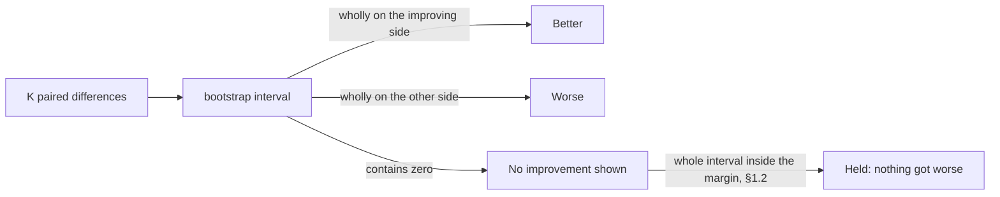
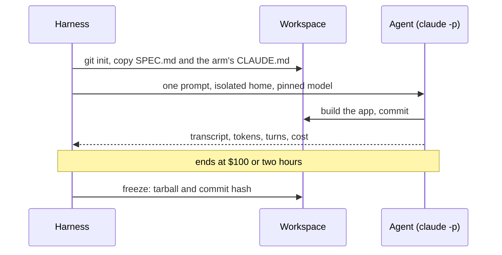
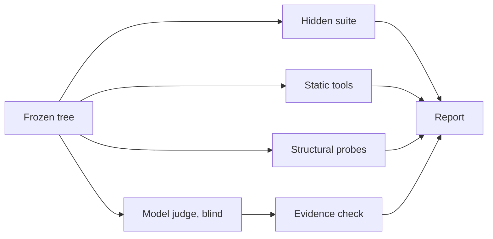

# Efficacy benchmark — does a generated context file improve the result?

**Owning issue:** #1184, applying the generic method in
`testing-ai-assets.md`.
**Results:** one dated report per round under `docs/audits/`.
**What runs:** the harness, scorer, judge and report under `tests/efficacy/`,
described in its README. The hidden test suite lives in a private
repository (§10).

## 1. Goal

Find out whether an agent given a `CLAUDE.md` generated by
`solid-ai-templates` builds a better application than the same agent with no
context file, given the same spec, model and tools, and at what cost.

**The idea in one example.** The agent builds the same app three times
without a context file and three times with one. Every build is scored on
each metric, so one metric gives three numbers per side.

Runs are compared with their partner, not side against side. Run 1 without
a file is compared with run 1 with a file, because the two ran on the same
day against the same model. The same goes for runs 2 and 3. The three
differences are what gets averaged.

| | run 1 | run 2 | run 3 | differences | verdict |
|---|---|---|---|---|---|
| without a file | 0.42 | 0.50 | 0.58 | | |
| with a file | 0.75 | 0.83 | 0.92 | +0.33, +0.33, +0.34 | **better**: every pair improved, by nearly the same amount |
| with a file, a metric that moved less | 0.45 | 0.60 | 0.70 | +0.03, +0.10, +0.12 | **better**: every pair improved, by an unsteady amount |
| with a file, a metric that did not move | 0.55 | 0.44 | 0.62 | +0.13, −0.06, +0.04 | **not shown**: two pairs improved and one got worse |

Overlapping columns say nothing on their own. The middle row's raw numbers
overlap, yet every pair moved the same way, so it reads **better**. Only the
bottom row, where the differences change sign, is undecided.

The report prints one such row per metric, the primary dimensions first. The
harness computes each verdict, so nobody decides one by eye.

### 1.1 Rules, fixed before the first run

The question, the metrics and the rule for reading a result are written down
before any trial runs. Nobody can then pick the metric or the threshold that
makes the templates look good after seeing the numbers.

| Setting | Value | Why |
|---|---|---|
| Unit compared | The difference between two arms' trials in the same block: `full-1` minus `none-1` | The arms in a block meet the same model on the same day |
| Result | The mean of the K differences, per metric, per contrast | — |
| Interval | Bias-corrected and accelerated bootstrap over the K differences: 10,000 resamples, 95 %, seed recorded | Shows how steady the effect is |
| Direction | Declared per metric (§6.2) | Half the metrics improve downward |
| Verdict | **Better**: interval wholly on the improving side of zero. **Worse**: wholly on the other side. **No improvement shown**: contains zero | "No improvement shown" does not mean "equal"; §1.2 covers that |

### 1.2 Rules for claiming "nothing got worse"

A trim is a change that shortens the templates. A trim may claim a metric
held only when the whole interval of its change lies inside the margin
below. "No improvement shown" does not mean "no worse".

| Metric | Unit | Margin: largest tolerated loss | Smallest change that matters |
|---|---|---|---|
| Hidden-test pass rate | percentage points | 2 | 5 |
| Adherence checklist | percentage points | 5 | 10 |
| Primary judge scores, 1–5 | scale points | 0.3 | 0.5 |
| Static-analysis counts per 1,000 lines | relative % | 10 | 25 |
| Change-task churn, files and lines | relative % | 15 | 30 |
| Security probe pass rate (from round 3) | percentage points | 2 | 9 |
| Data-protection probe pass rate (from round 3) | percentage points | 10 | 30 |

- An adherence gain counts only if pass rate held. Following rules while
  breaking the app is not an improvement.
- A trim is free only if every metric held.
- The report shows every metric. Its summary score decides nothing.

This is a non-inferiority test, as used in drug trials to show a new
treatment is no worse than the standard one by more than a set margin. With
K = 3 it describes the result; it does not prove it.

### 1.3 Few trials, and the one escalation

**Three trials are a description, not proof.**

- Three differences give the bootstrap only 27 distinct resamples.
- No arrangement of three trials reaches conventional significance.
- The report says so beside every interval, not in a footnote.

**One escalation to K = 5 is allowed, once, under fixed conditions.**

- It is owed where a primary dimension's interval contains zero while its
  mean difference exceeds the smallest change that matters (§1.2).
- Any contrast can trigger it, and the effect counts in either direction.
- One further block runs. The report prints the K = 3 and K = 5 results side
  by side.
- K never exceeds 5. A second inconclusive result is reported as
  inconclusive.
- The report computes whether the escalation is owed.

Why: sampling until an interval clears zero is the failure this bound
prevents.

### 1.4 Failed and lost trials

**A failed trial is scored as it stands and never re-run.**

- A trial that produced no installable workspace scores zero on task
  success.
- Its quality metrics are recorded as missing, never filled in.

Why: re-running one arm's failures quietly improves that arm.

**A lost trial is re-run once, in its own place in the order.**

- A trial is lost when the CLI ends it with any error other than the budget
  cap: a usage limit, a rate limit, a crash, or no result at all.
- Its partial workspace is kept under the run's `void/` directory and never
  scored.
- A second loss of the same trial stops the run.
- A trial ended by the budget cap or the timeout is not lost. Both are
  bounds §4.1 sets, and the trial is scored as it stands.

Why: the provider cut it, not the agent.

## 2. The app — `tariff`

### 2.1 What it does

"Tariff" here means a price list. `tariff` is a small invoicing engine: it
takes a basket of products and computes the final bill, with discounts and
tax. The tax is VAT or sales tax, not customs duty.

| Piece | What it is | Example |
|---|---|---|
| Product | A SKU, a name, a unit price and a tax category | `COF-250G`, "Coffee", €10.00, category `food` |
| Discount rules | Percentage, bulk ("buy 3, pay 2"), tiered (cheaper unit price from a quantity), coupon code | 10 % off coffee; coupon `WELCOME` takes €5 off |
| Jurisdiction | A country or region with a tax rate per category and a default rate | DE: `food` 7 %, everything else 19 % |
| Invoice | A currency, lines of product × quantity, and coupon codes | 3 × coffee, EUR, `WELCOME` |

A SKU (Stock Keeping Unit) is the unique code a shop gives each product it
sells. A 1 kg bag of the same coffee would be another SKU.

`price()` works in a fixed order: line discounts first, then invoice-wide
discounts, then those discounts spread back over the lines, then each line
taxed at its category's rate. Every amount is exact to the cent.

It suits the benchmark for three reasons:

- Its domain is naturally modelled with objects and classes.
- It has two independent extension axes, discount kinds and jurisdictions,
  so a missed Strategy pattern shows.
- Exact decimal arithmetic makes the hidden tests unforgiving.

The app is offline and deterministic, about 1,500–2,000 lines of code.

### 2.2 What the spec fixes

`tests/efficacy/SPEC.md` names what other software depends on, so the
hidden suite can drive it:

- **Domain:** products, the four discount kinds with their precedence and
  stacking, jurisdictions with rate tables, invoices.
- **Money:** `Decimal` throughout, one currency per invoice, half-even
  rounding at named points, totals reproducible to the cent.
- **Python API:** `tariff.Catalog`, `tariff.Invoice`,
  `tariff.price(invoice, rules, jurisdiction)`, the error base
  `TariffError`. The package imports without the web app.
- **Web UI:** Flask, Jinja and HTMX pages for products, rules and
  jurisdictions, and an invoice builder that re-prices on every change.
  Pages work with JavaScript disabled.
- **HTTP:** named routes, a JSON export, form posts with server-side
  validation and CSRF.
- **Persistence:** one SQLite file, schema owned by the app, a seed fixture.
- **Sign-in and customers:** one seeded administrator and every route
  behind sign-in; customers with a name, email and address, billed on
  invoices; erasure on request; a JSON export of one customer's data.
- **Constraints:** no network, Python 3.12, valid HTML.

### 2.3 What the spec leaves out

**The spec says what the app does, never how it is engineered.** It does not
name:

- a layout, linter, type checker, logging policy or test convention
- an error hierarchy's shape or a template organisation
- an accessibility bar
- how a password is stored, what a failed sign-in says, or where a redirect
  may lead
- whether an erased customer's data leaves the database file

Why: the "how" is what a context file adds. If the spec said "hash the
password", every arm would, and the benchmark would measure nothing.

## 3. Arms

### 3.1 The five arms

Every arm starts from an empty git repository holding `SPEC.md`. All but
`none` add a `CLAUDE.md`.

| Arm | Adds | Budget | Asks |
|---|---|---|---|
| `none` | nothing: the bare agent | — | the baseline every file is compared with |
| `full` | the file the interview generates, inline | none | do the templates help as shipped |
| `short` | the file the interview generates, inline, under a budget | ≤ 40 lines, ≤ 88 characters wide | does a short generated file help |
| `hybrid` | the file the interview generates in its hybrid model, with the templates vendored into the workspace | none | does the model the owner's projects use help |
| `hand` | a hand-written file | ≤ 40 lines | is the effect the templates, or merely having a file |

The report prints each file's measured line count.

### 3.2 Trial names

A trial is `<arm>-<block>`: `short-2` is arm `short`'s trial in block 2,
paired with `none-2`. Blocks run in order and arms interleave within each:
`none-1`, `full-1`, `short-1`, `hybrid-1`, `hand-1`, `none-2`, and so on.

Round 1 named its arms by letter. Reading its report, A is `none`, B is
`full` and C is `hand`.

### 3.3 How the generated files are made

**One non-interactive invocation per generated arm, and no person answers
questions.** `tests/efficacy/generate_arm.py` hands the generator:

- `INTERVIEW.md` and the chain resolved at `v2.90.0`
- the project brief, [`tests/efficacy/brief.txt`](../../tests/efficacy/brief.txt)
- the arm's output model (inline or hybrid) and, for `short`, its budget

A record of each generation is committed beside its file as
`generation.json`: the release and the chain it resolved, the model, the
CLI's result, both leak scans and the budget check.

Why: a conversation would put the answerer's judgement into the file, and a
re-run would produce a different arm.

**The length rule.** A file's length is its count of newline-terminated
lines.

- `short`'s file must be at most 40 lines, none longer than 88 characters.
- The generator refuses a result over either bound rather than trimming it.
- `hybrid` has no budget. The interview's hybrid model fixes what it inlines
  and what it refers to.
- `short` and `hand` sit within a line of each other, so `short − hand`
  compares content at a fixed length.

Why: trimming by hand would put a person's judgement into the arm.

**`hybrid` reads the templates from its own workspace.** Its workspace
carries this repository's `templates/` directory at `v2.90.0` under
`docs/solid-ai-templates/templates/`.

- Only that directory is copied. The release also holds this design, and
  the arm would read its brief.
- The copy is kept out of the workspace's index and counts in no size or
  scope metric.

### 3.4 What the brief tells the interview

The brief is what an adopter would type:

- the domain in one line, naming discount rules and tax jurisdictions
- the stack: Python 3.12, Flask 3, Jinja, HTMX, SQLite, uv, ruff, mypy
  strict, pytest
- the system's boundaries and actors: a person in a browser and another
  program; the pricing engine importable without the web app; a local
  store; no network

Why each part is there:

- The two extension axes are named because an adopter building this app
  would name them. A brief withholding them measures a product nobody uses.
- The stack is named because the spec fixes it for every arm. An interview
  left to choose might pick FastAPI and build a different app.
- The boundaries are there because establishing a system's boundaries and
  its interfaces is the interview's job.

Before round 3 the brief also states that customers carry personal data
(#1767).

**What naming the axes affects.** The report states this beside the rows it
touches:

| Measure | Affected |
|---|---|
| Extension points for rule kinds and jurisdictions; the OCP rubric row for them; the change task | Yes. The generated arms' interview was told the axes exist. The other arms read the same axes in `SPEC.md` |
| Extension point for a new export format | **No.** The brief names no export, so every arm meets this axis only through the spec |
| Everything else: task success, cost, quality counts, layering, complexity, the other rubric rows | No |

The export axis is therefore the untouched open-closed probe, and the report
leads its OCP finding with it.

**What the brief never states.** No rule semantics, rounding mode,
precedence or stacking order, route path, API name, error hierarchy or
fixture.

**Checked before the first trial:** two scans guard the generated files.

- The prompt scan is broad. A generation is never handed `SPEC.md`, so any
  spec-only token in the prompt means the wiring is wrong.
- The output scan is narrow. Once the prompt is clean, only data nobody
  could derive, such as a seed SKU, a rule id or a worked figure, counts as
  a leak.
- A hit refuses the generation rather than warning.

## 4. Protocol

### 4.1 The build trial

Every arm gets one prompt, identical for all:

> Implement the application described in SPEC.md. Done means:
> `pip install .` succeeds in a clean virtualenv, your own tests pass,
> and every page and route in the spec works end to end against the
> seed fixture. Commit when done.

**Isolation.** Each trial runs apart from the machine and from the others:

| What | How |
|---|---|
| Your global `CLAUDE.md`, hooks, memory, MCP | A scratch home and a minimal settings file |
| The launching session's environment | Its variables, editor, active interpreter and credentials are removed; the names removed are recorded |
| The model | Pinned by exact id; effort fixed |
| The web | Web tools disallowed. The shell keeps its network, because every trial installs packages |
| The templates repository | Not mounted |
| Git's stored credentials | Cleared |
| Temporary files | Each trial gets its own directory; entries it left in the machine's are moved into it |
| Leftover processes | Stopped when the trial ends |

**Bounds.** A trial ends at $100 of the CLI's own cost figure or at two
hours. The timeout is the bound that shapes a trial; the budget stops a
runaway. §11 gives the figures behind them.

**Records.** Transcript, token usage, turns, wall time and cost are kept,
and the record says which bound ended the trial. The workspace is frozen as
a tarball plus commit hash before scoring. The run record is rewritten after
every trial, so a stopped run keeps every trial it finished.

### 4.2 The change task

The change task measures how far each design has to be disturbed to take a
change it was not built for.

- It starts from a copy of its own build trial's frozen workspace, so each
  arm's change task still carries that arm's context file.
- The copy's state is committed first. Churn counts only what the agent
  changed after that commit.
- It runs under the same isolation, bounds and outcome rules, interleaved in
  the same order.
- There is one per build trial. A build trial with nothing scorable has
  none.
- Its prompt is fixed in
  [`tests/efficacy/change-prompt.txt`](../../tests/efficacy/change-prompt.txt).

§5.4 describes the task and how it is scored.

### 4.3 Everything is automated

A run is one command. Generating the arms, the build trials, the change
tasks, the hidden suites, the static and structural tools, the judge and the
report are all scripted. Each records its inputs, exact invocation and
outputs. No step waits for a person.

Why:

- A result can be re-run to check it.
- A later template revision can be measured against the same run (§9).
- An operator's judgement cannot leak into the arm they touched.

## 5. Scoring

Each frozen trial goes through the same pipeline:

### 5.1 Task success and the backbone

These run on every trial, deterministically.

**Task success** is the hidden suite's pass rate. The suite lives in a
private repository and is cloned only at scoring time, never into a
workspace. It covers:

- the Python API: rule precedence, stacking, tier boundaries, rounding to
  the cent, jurisdiction tables, invalid rules refused
- every route through the Flask test client, including HTMX fragments that
  re-price correctly
- the JSON and CSV exports, byte-exact against the seed
- forms with JavaScript disabled, and browser flows through Playwright

The rest of the backbone:

- **Install:** `pip install .` in a clean virtualenv, `import tariff`, and
  the app boots and serves `/`.
- **Web quality:**
  - accessibility: axe-core WCAG 2.1 AA violations
  - HTML validity, less errors on HTMX's `hx-*` attributes, which the spec
    requires and the HTML standard lacks
  - an XSS probe and a CSRF probe
  - the invoice builder's response size and request count
- **Adherence:** the share of a fixed checklist passed.
  - Tools: `ruff` clean, `mypy --strict` clean, coverage ≥ 80 %, cognitive
    complexity ≤ 15.
  - Structure: a `src/` layout, an error-contract test, a `NullHandler`.
  - Hygiene: no `print` in library code, no citations.
  - Packaging: complete metadata, a README with install and usage,
    discoverable tests.
- **Cost:** tokens, turns, wall time, API-equivalent dollars.
- **Scope:** files and lines, and artifacts nobody asked for (ADR, journal,
  CHANGELOG, PLAYBOOK).
- **Consistency:** the spread of every metric across an arm's trials.

Adherence runs on every arm. It is a quality checklist, not a template
checklist, so the bare arm can score on it.

### 5.2 Code quality

**One ruler for every arm.** The tools run at the harness's pinned versions
and configuration, never the configuration the agent wrote. Counts are
reported absolute and per 1,000 lines.

**Finding the code.** Each arm picks its own layout, so the tools never
assume `src/`.

- The harness imports the installed package and takes its directory.
- It adds every top-level package directory in the workspace.
- It passes those paths to every tool explicitly.

Why: a tool pointed at an empty `src/` reports zero findings, and "zero
findings" must never mean "nothing scanned".

**A tool that scanned nothing records the metric as missing, never zero.**
The same holds for a tool that failed or timed out. The report shows how
many files and lines each tool saw. A clean arm can then be told from an
unmeasured one.

| Tool | Measures |
|---|---|
| `ruff check --select ALL` | violations, by category |
| `ruff format --check` | files needing reformatting |
| `mypy --strict` | type errors |
| `bandit` | security findings, high and medium |
| `complexipy` | cognitive complexity: max, mean, functions over 15 |
| `radon` | cyclomatic complexity and maintainability index |
| `interrogate` | docstring coverage |
| `vulture` | unused code |
| `pytest --cov` | line and branch coverage of the agent's own tests |

Not measured: mutation score, class cohesion, and pylint's refactoring
checks.

### 5.3 Design structure

The harness probes each tree's structure directly:

- **Layering:** the domain imports neither Flask nor the persistence
  module, and routes do no `Decimal` arithmetic.
- **Import graph:** mutual imports, and the mean instability of domain
  modules (Martin), through `grimp`.
- **Extension points:** can a new discount kind, jurisdiction or export
  format be added without editing existing code? Present or absent, per
  axis.
- **Kind ladders:** conditionals that dispatch on a rule's kind.
- **Boolean parameters:** a branch the caller cannot name.
- **Public surface:** names exported against names the spec requires.
- **IO isolation:** pricing takes values, not database rows or a
  connection.
- **Hygiene:** `print` calls, exception bases, citations, logging set up
  with a `NullHandler`.

### 5.4 The change task: the open-closed measure

**The task must lie outside what the spec already allows.** Otherwise it
measures data entry, not design. It adds two things:

- a **spend-threshold discount**: 5 % off once the subtotal reaches 200.00,
  applied before coupons
- a **capped reduced rate**: one tax category taxed at the reduced rate on
  the first 50.00 of a line and at the standard rate above it

Neither is reachable by configuration:

- The threshold rule is the first invoice rule that depends on a condition
  over the invoice. Every existing kind is unconditional or gated only by a
  coupon code.
- The capped rate is the first tax that is not one rate times one amount,
  so it changes the shape of the tax step, not its inputs.

**Measured:** files touched, lines changed, whether the build suite is
still green, whether the change-task acceptance module passes, and whether
the new rule and rate show in the same API and UI. A new rule class plus a
registry entry scores low churn. Editing the pricing function, the tax
step, three routes and two templates scores high.

**The acceptance module is written before any change-task run.** It tests
the two new behaviours against worked figures.

Why: churn means something only beside a pass. An arm that touched four
lines and broke the extension has not scored well.

### 5.5 Pattern use

For each design pattern found, the judge records where it is, what it
removes or opens, and whether it has more than one implementation.

- **Invited by the app:** Strategy for the discount kinds, a registry or
  Factory to resolve a rule or jurisdiction by name, Composite or a
  precedence chain for stacking, Adapter for the exports, Builder for an
  invoice.
- **Scored on the property, not the name:** a design that reaches the same
  extension points another way scores the same.
- **Over-engineering:** a pattern with one implementation that removes
  nothing, per `oop.md`.
- **Missed:** a conditional ladder over rule kinds where a Strategy was
  warranted.

Reported as warranted, missed and over-engineered counts.

### 5.6 The model judge

**The rubric.** Each row is scored 1–5 with a quoted evidence line: SRP,
OCP, LSP, ISP, DIP, naming and abstraction level, error design,
readability, maintainability, and test quality.

**Primary dimensions:** design (SOLID and pattern use), readability and
maintainability. The report leads with them; task success and cost follow.
Security and data protection join them from round 3 (§5.8).

**How it judges:**

- **Anchored:** each primary describes its 1, 3 and 5 in terms of this
  domain. A scale saying only "1 is poor, 5 is excellent" put 3 on ordinary
  work every time.
- **Three times:** each tree is judged three times and the scores are
  averaged. One judging is not reproducible.
- **Blind:** the context file and any condition marker are stripped, the
  order is shuffled at a recorded seed, and a bundle that still names its
  arm is not judged.
- **A different vendor:** `gpt-6-astra` through `codex exec`, while the
  generator is Claude. The model id and reasoning effort are recorded.

### 5.7 How the judge is checked

No person scores the judge. Two automated checks do:

- **The evidence check:** every line the judge quotes is looked up in the
  bundle it was quoted from, and the report prints the share found per
  trial. A judge that never opened the code still returns plausible
  numbers; this is what tells the two apart.
- **The control fixture:** six trees built from one pinned application
  (`tests/efficacy/control/`). Every tree passes the same tests, so only
  structure separates them. Some are damaged, some improved. A primary
  dimension counts only if it falls on the damaged trees and rises on the
  improved ones.

A second judge, Claude through the `claude` CLI, reads the control fixture
only, never a round, and its scores are never averaged with the first
judge's.

### 5.8 Security and data protection

**From round 3, security and data protection are primary dimensions.**
Each is read two ways, and both readings are primary:

| Metric | What it is | Direction | Margin | Smallest change that matters |
|---|---|---|---|---|
| `judge_security` | anchored judge row, 1–5 | up | 0.3 points | 0.5 points |
| `judge_data_protection` | anchored judge row, 1–5 | up | 0.3 points | 0.5 points |
| Security probe pass rate | share of the security probes a trial passes | up | 2 pp | 9 pp |
| Data-protection probe pass rate | share of the data-protection probes a trial passes | up | 10 pp | 30 pp |

**Security probes (11):**

- a plaintext password at rest
- sign-in failures that reveal which accounts exist
- an open redirect after sign-in
- no CSRF on sign-in
- a hard-coded secret key
- debug left on
- SQL built from strings
- known vulnerabilities in the installed dependencies
- missing session cookie flags
- missing security headers
- stack traces in answers to malformed requests

**Data-protection probes (3):**

- a sentinel customer email found in the logs
- an erased customer's sentinel still in the database file
- one customer's export carrying another customer's data

**How the probe margins are set.** Both follow one rule, so the figures
change only if a probe count does:

- The margin is less than one probe lost in one trial. With K = 3 that is
  under 3.0 pp for security (1 of 11) and under 11.1 pp for data
  protection (1 of 3). No probe may be lost.
- The smallest change that matters is one probe lost in every trial: 9.1 pp
  and 33.3 pp, rounded down to 9 and 30.

**Before round 3's first trial:**

- Each judge row is anchored at 1, 3 and 5 in terms of this domain.
- Each passes the control fixture: it falls on a tree that damages it and
  rises on one that improves it.

The last seven security probes are `tests/efficacy/security.py`'s checks.
They were declared after round 1, so they described that round and decided
nothing (§6.4). Fixed here before round 3, they decide it.

## 6. Report

### 6.1 Contrasts

Each metric is reported per arm and for eight paired contrasts:

| Contrast | Asks |
|---|---|
| `full − none` | do the templates help as shipped |
| `short − none` | does a short generated file help |
| `hybrid − none` | does the hybrid model help |
| `hand − none` | does any file help |
| `full − hand` | do the templates beat forty hand-written lines |
| `short − hand` | at equal length, can the templates pick the right forty lines |
| `hybrid − full` | does the hybrid model beat the same content inline |
| `short − full` | does length matter |

`full − hand` is the question an adopter asks. A large `full − none` beside
an equally large `hand − none` is not a result for the templates.

**Reading `short − hand`:**

- `short` ≈ `hand` (no improvement shown, every quality metric held): the
  templates' content is sound, and the interview emits too much.
- `short` worse than `hand` on a primary dimension: the content itself is
  the defect.

**A contrast pairing trials from different rounds gets no verdict.** It keeps
its mean and interval and counts as neither a win nor a fail.

### 6.2 Metric directions

- **Better upward:** task success, adherence, coverage, docstring coverage,
  extension points present, every judge score, the security and
  data-protection probe pass rates.
- **Better downward:** every static-analysis count, cognitive and cyclomatic
  complexity, tokens, turns, wall time, cost, files, lines, artifacts nobody
  asked for, change-task churn, axe violations, HTML errors.
- **Neutral, reported without a verdict:** maintainability index,
  instability.

### 6.3 What the report prints

The report is `docs/audits/YYYY-MM-DD-efficacy.md`.

**It opens with the finding table.** One column per context file against
`none`, headed by the file's line count:

- **Improves the code?** Yes where a primary dimension or task success is
  better and none worse; Worse where any is worse; No where none is better.
- the primary dimensions that moved
- the hidden-suite pass rate against `none`, naming any run below it by more
  than the smallest change that matters
- code size and cost, as signed shares of `none`'s, where the interval
  separated them
- a one-phrase reading

Under the table:

- one line per file on why it scored so, in words
- one line reading the columns together
- one line scoring the contrasts between two files, 1 to 10:
  1 + 9 × wins ÷ (wins + fails). A win or fail is a metric better or worse;
  "no improvement shown" counts neither way.
- one line of caveats: the escalation, withdrawn metrics, lost trials,
  reaches past a workspace, and the judge's evidence check

The table and the score describe the verdicts and decide nothing. Every cell
rests on a verdict or record below it.

**Then the record:**

- model ids, CLI versions and the template revision
- each generated arm's brief and token scan
- K and the bootstrap seed
- every trial's raw numbers
- every trial that failed or was re-run, and why
- the judge's evidence check
- the verdict vector

### 6.4 Checks declared after a run

**A check chosen after the results were seen can describe a run but never
decide it.**

- It is declared in writing, with its direction, before any trial is read
  for it.
- The report prints it in its own section, with means and intervals and no
  verdict.
- It never enters the verdict vector, a "nothing got worse" claim or the
  escalation.
- A check worth deciding on is fixed before the next run instead.

Why: otherwise the bar moves with the results.

### 6.5 Withdrawn measurements

**A metric whose grader turns out to measure something else is withdrawn,
not reported.**

- The withdrawal is recorded in `tests/efficacy/withdrawn.json` against the
  grader's revision.
- Every run that revision graded loses the metric; a run graded by a
  corrected revision keeps it.
- The report names the metric and the reason, with no number, interval or
  verdict.
- A corrected grader never re-grades the same trials. The correction is
  fixed before the next run.

## 7. Confounds and their controls

A confound is a second cause mixed up with the one being tested, so the
result cannot say which produced it. A control is what rules it out.

| Confound | Control |
|---|---|
| Your global `CLAUDE.md` or hooks reach the bare arm | A scratch home per trial; the harness refuses a run when a `CLAUDE.md` exists in that home or any parent directory |
| The agent reads the templates, the hidden suite or the web | Nothing mounted; web tools off; Git credentials cleared; transcripts scanned, and each hit named in the report |
| `hybrid` legitimately carries the templates | Its reads of its own vendored copy are not a reach; naming the repository by URL or owner still is |
| The model changes between trials | Exact id pinned; trials interleaved |
| The agent sees the acceptance tests | The hidden suite stays outside the workspace until scoring |
| The judge favours its own family or longer output | A different vendor from the generator; blind; shuffled; length reported |
| The judge sees which arm it reads | Context files, the vendored templates and condition markers are stripped; a bundle still naming its arm is refused |
| The judge's score is noise | Three judgings per tree, averaged |
| The judge's scale cannot move | Anchored primaries, validated by the control fixture (§5.7) |
| A grader measures something else | Withdrawn measurements (§6.5) |
| A trial is lost to the provider | One re-run in place (§1.4) |
| The spec changes between rounds | No trial is reused across spec versions |
| The bar moves after seeing results | The rules in §1 and this document are committed before the first trial |
| One task measures one task | A stated limitation; `ledger`, a second app, stays sealed for the final claim |

## 8. Budget

Round 3 runs five arms at K = 3. Figures per trial are measured in rounds 1
and 2.

| Item | Count | Per item | Round total |
|---|---|---|---|
| Build trials | 15 | 16–28 min, $8.7–$16.7 | about 4–7 hours, about $195 |
| Change tasks | 15 | $5–$17 (round 1) | about $130 |
| Judgings | 45 (15 trees × 3) | — | ChatGPT plan quota |
| Escalation to K = 5, if owed | +10 build, +10 change, +30 judgings | as above | about $215 more |

Both CLIs bill against a subscription, so this is quota, not invoice.

## 9. Reuse as the template benchmark

The same harness measures a template change. The **baseline** is the current
templates; the **candidate** is the trimmed or rewritten version. Same
paired design, same rules.

Round 3 is that baseline for v3.0: v3.0's evidence phase re-runs this
harness with the fork's chain and compares against it.

**A trim is a free win only where every quality metric held (§1.2) and
tokens fell.**

- "No improvement shown" on each row is not enough. Three trials are too
  few to detect a real regression.
- Where K = 3 cannot support "held" for a metric, the trim is unproven, not
  safe.
- A trim that turns any primary dimension worse is rejected.

Why: accepting on "no improvement shown" would pass a trim that broke
something.

Two limits:

- Each iteration costs a full set of trials, so trims are batched per file,
  not per rule.
- Tuning against one app overfits to it. `tariff` is the development app;
  `ledger` stays sealed for the final v3.0 claim.

## 10. Decisions

| Date | Decision | Why | Issue |
|---|---|---|---|
| 2026-09-12 | The app is `tariff`, chosen over `logsift`, `flowkit`, `ledger` and `convert` | Natural object model, two extension axes, sharp decimal tests | #1712 |
| 2026-09-12 | The hand-written arm runs | Only it separates the templates from having any file | #1705 |
| 2026-09-12 | K = 3, one bounded escalation to 5 | The smallest set an interval can be computed on; the bound stops sampling to significance | #1705 |
| 2026-09-12 | Generator `claude-sonnet-5` at effort `high`; judge `gpt-6-astra` through `codex exec`, effort set explicitly | What a typical adopter runs; a stronger model's ceiling would hide the effect; a different vendor judges | #1711 |
| 2026-09-12 | The hidden suite lives in the private `braboj/tariff-hidden-suite` | This repository is public, so a suite here is one search away from a future trial | #1705 |
| 2026-09-12 | Flask stays | Server-rendered Jinja with HTMX is its home ground | #1705 |
| 2026-09-12 | The baseline runs against `v2.90.0`, before the v3.0 split moves any template | §9's comparison needs a baseline older than the move | #1705 |
| 2026-09-12 | The hidden suite is written and validated before any trial | Written afterwards, it would be shaped by the first outputs (§11) | #1714, #1715 |
| 2026-09-12 | The brief names the two extension axes | An adopter would; §3.4 states what that costs | #1713 |
| 2026-09-12 | The change task adds a spend threshold and a capped rate, replacing a first draft of buy-one-get-one and a reduced rate | Both first-draft items were already expressible by configuration, so every arm would score zero churn | #1717 |
| 2026-09-12 | Trials are bounded by `--max-budget-usd` and a timeout | The installed CLI (2.1.153) has no `--max-turns` | #1710 |
| 2026-09-15 | HTML validity sets aside errors on `hx-*` attributes | The spec requires HTMX; otherwise the metric counts how much HTMX a trial uses | — |
| 2026-09-15 | The escalation reads the effect in either direction, on any contrast; a row with no interval triggers nothing | An escalation owed only to a favourable effect would lean toward "better" | — |
| 2026-09-16 | Security and data protection become primary dimensions from round 3 | Owner decision after reading round 1's report | #1767 |
| 2026-09-16 | Round 1 is read for security with checks declared after the run | Its fixed security checks passed on every trial and separated nothing | #1766 |
| 2026-09-17 | The report opens with a 1–10 score per contrast, replacing "no single headline number" | Asked for after reading round 1 | #1786 |
| 2026-09-17 | The finding table opens the report | Asked for after reading the score table | #1789, #1791, #1796, #1798 |
| 2026-09-17 | Round 1's change-task pass rate is withdrawn | Its grader built the new rule and rate through names the prompt never gave | #1772 |
| 2026-09-17 | No human holdout | Scoring many implementations by hand cannot be sustained, and a person in the loop breaks §4.3 | #1774 |
| 2026-09-17 | Round 2 holds length fixed and adds the hybrid model | Owner's reading of round 1: the generated file is too long to add quality, and a short one can¹ | #1795 |
| 2026-09-18 | The score table stays only for contrasts between two files | Beside the finding table it repeated itself | #1820 |
| 2026-09-18 | A contrast crossing rounds gets no verdict | Round 2's `full` read Worse because `none` moved between rounds, not the file | #1826 |
| 2026-09-19 | The primaries are anchored and checked by the control fixture | Unanchored, `design` and `maintainability` scored 3 on all 24 trials of rounds 1–2 | #1827, #1829, #1830 |
| 2026-09-19 | Each tree is judged three times | Six judgings of one unchanged tree disagreed (§11) | #1830 |
| 2026-09-19 | A second judge, Claude, reads the control fixture only | A second vendor's reading of the same trees; never averaged with the rounds' judge | #1831 |
| 2026-09-24 | Round 3 starts anew with all five arms and reuses no trial | The spec gained sign-in and customers, and the judge changed | #1767 |
| 2026-09-24 | Eight contrasts, adding `short − full` | Does length matter | #1767 |
| 2026-09-24 | The brief and the change prompt live in files of their own | The design's restructure would have broken the code that read them by heading | #1843 |
| 2026-09-24 | Security and data protection: an anchored judge row and a probe pass rate each, all primary; probe margins mean no probe lost | A judge row alone is an opinion; the probes are deterministic. Security regressions get no tolerance | #1767 |

¹ This agrees with Anthropic's guidance on context engineering, which asks
for the smallest set of high-signal tokens:
[Effective context engineering for AI agents](https://www.anthropic.com/engineering/effective-context-engineering-for-ai-agents).

## 11. Appendix — the numbers behind the rules

**Why three trials cannot reach significance.** Three paired differences
give a bootstrap 27 distinct resamples and an exact sign test a minimum
two-sided p of 0.25.

**Why the judge reads each tree three times.**

- **Measured:** six judgings of one unchanged bundle returned readability
  4, 4, 4, 3, 4, 4. Mean 3.83, sample SD 0.41.
- **Effect:** about 0.33 standard error on a difference of two arm means at
  K = 3.
- **Why it mattered:** readability was the only primary that moved in
  rounds 1 and 2, so every verdict rested on the row that was not
  reproducible.
- **The fix:** three judgings cut that standard error by about 40 %.
- **Rows that did not need it:** eight of the eleven returned the same
  score on all six calls.

**Why the budget is $100 and the timeout two hours.** The CLI prices
`claude-sonnet-5` at $5 per million input tokens and $25 per million output.
It checks the budget between turns, so a trial can pass it by one turn's
cost. The agent that built the hidden suite's reference implementation, on
a stronger model, spent about $13 at that rate in 26 minutes. At that pace a
two-hour trial stays under the cap.

**How the hidden suite was validated.**

<!-- measured: 2026-09-12 -->
377 checks across 16 modules in `braboj/tariff-hidden-suite`, validated two
ways before any arm existed.
<!-- /measured -->

- A reference implementation written from the spec alone passes every
  check, so a correct implementation is not marked wrong.
- A mutation control plants five spec violations one at a time, and the
  suite catches all five.

Round 3 extends the suite to sign-in and customers, and both validations
run again before its first trial (#1767).
