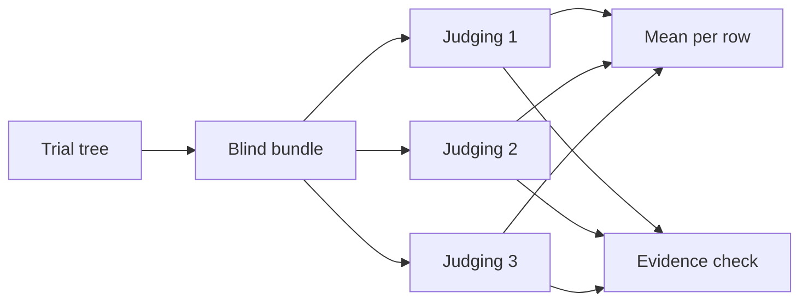

# Efficacy benchmark

Does a generated context file improve the result? The design, its rules and
how a result is read live in `docs/design/efficacy-benchmark.md`. This
directory holds the parts that run.

| Path | What it is |
|---|---|
| `SPEC.md` | the application every arm is asked to build; copied into each workspace |
| `brief.txt` | the project brief the generated arms' interview reads, the only copy |
| `change-prompt.txt` | the change task's prompt, the only copy |
| `arms/<arm>/CLAUDE.md` | each arm's context file: `full`, `short`, `hybrid` generated, `hand` hand-written |
| `arms/<arm>/generation.json` | the record of each generated file's generation |
| `generate_arm.py` | generates one arm's file through the interview |
| `harness.py` | sets up a workspace, runs one trial in isolation, freezes the result |
| `score.py` | scores one frozen trial: install, boot, the hidden suite, the static tools, adherence, scope, cost |
| `probes.py` | the structural and web-quality probes that run inside the trial's own interpreter |
| `scoring-requirements.txt`, `toolconfig/` | the one ruler: the tools, and the configuration every arm is measured under |
| `judge.py` | builds a blind bundle per trial and runs the model judge over it |
| `security.py` | reads each trial for security |
| `report.py` | the contrasts, intervals, verdicts and the report under `docs/audits/` |
| `withdrawn.json` | metrics withdrawn after grading, keyed by the grader's revision |
| `reuse.py` | copies an earlier round's trials into a new run root |
| `control/` | the rubric control: six trees that check the judge |

## Before a run

The harness, scorer and judge reach outside Python. A missing piece shows up
as a refusal or a missing metric, not a crash.

| Needs | For | Without it |
|---|---|---|
| `claude` on `PATH`, logged in | every trial, every arm's generation, and the judge | the preflight refuses the run |
| `gh`, logged in with access to `braboj/tariff-hidden-suite` | scoring clones the hidden suite | scoring refuses |
| a Java runtime on `PATH` | `html5validator`, the HTML validity metric | that metric is missing |
| a Playwright browser | the suite's browser flows and the accessibility probe | scoring installs one, and refuses the trial where it cannot |
| `codex` on `PATH`, logged in | the cross-check judge, on a sample | each of its judgings fails |

`score.py --no-web` skips both browser-side probes and installs no browser.
The suite then skips its browser flows, and the trial is flagged as partial.

## The arms, and how a trial is named

| Arm | Starts with |
|---|---|
| `none` | `SPEC.md` alone: the bare agent |
| `full` | the templates' file, generated through the interview, inline |
| `short` | the templates' file, generated under a 40-line budget |
| `hybrid` | the templates' file in the hybrid model, with the templates vendored |
| `hand` | the hand-written file |

A trial is `<arm>-<block>`: `short-2` is arm `short`'s trial in block 2,
paired with `none-2`. Every workspace, tarball, score, judging and `--from`
or `--trial` argument uses that name.

Round 1 named its trials by letter: `A1`, `B2`, `C3`. Its files keep those
names on disk, and every reader maps them to `none`, `full` and `hand`.

## Generating an arm

```bash
py tests/efficacy/generate_arm.py --self-test
py tests/efficacy/generate_arm.py --arm short --root <outside this repository> --dry-run
py tests/efficacy/generate_arm.py --arm short --root <outside this repository>
```

**One non-interactive invocation per generated arm** (`full`, `short`,
`hybrid`), per the design's §3.3.

- The brief is read from `brief.txt` and treated as the client's answers.
  Nobody answers questions.
- The instruction names the arm's output model and, for `short`, its budget:
  at most 40 lines, none over 88 characters.
- A result over either bound is refused and kept beside the record as
  rejected, never trimmed.
- An existing file is never overwritten without `--replace`.

Why: a person answering or trimming would put their judgement into the arm.

**The record.** Each generated file has `generation.json` beside it: the
release and the chain it resolved, the model, the CLI's result, both leak
scans and the budget check. The report reads it from there.

**Two leak scans ask different questions.**

- The prompt scan is broad. A generation is never handed `SPEC.md`, so any
  spec-only token in the prompt means the wiring is wrong.
- The output scan is narrow. Once the prompt is clean, only data nobody
  could derive, such as a seed SKU, a rule id or a worked figure, is a leak.

**Checking it.** The self test proves the leak scan and the budget can fail.
The dry run builds and scans the prompt without calling a model: the cheap
check after any change to the brief, the roots or an arm's clause.

## Running it

```bash
py tests/efficacy/harness.py --root <a directory outside this repository> \
    --arms none,full,short,hybrid,hand --k 3 --model <exact id> --dry-run
```

**A dry run** prepares every workspace and records the command without
calling a model.

- It works in `<root>-dry-run` beside the root, cleared first.
- It leaves the root untouched, so the real run can use the same root.
- Drop `--dry-run` to run the trials.

**`--arms` is required.** A run names the arms it holds. Trials interleave:
`none-1`, `full-1`, `short-1`, `hybrid-1`, `hand-1`, `none-2`, and so on.

Why: a model-side change part-way through then lands across the arms, not on
one of them.

**The harness refuses:**

- a root inside this repository, where an arm could read the templates
  `none` is defined not to have
- a run that a context file above the workspace would reach
- a workspace that already exists
- a generated arm whose context file does not exist yet

**`hybrid` gets the templates in its workspace.** The repository's
`templates/` directory at the recorded release is copied to
`docs/solid-ai-templates/templates/`, where a submodule would put it.

- Only that directory is copied. The release also holds the benchmark's
  design, and the arm would read its brief.
- The copy is kept out of the workspace's index through `.git/info/exclude`
  and counts in no size or scope metric.
- For this arm the reach scan counts the repository as reached only when a
  call names its owner (`solid-ai-dev/solid-ai-templates` or the redirected
  `braboj/solid-ai-templates`). No path into the vendored copy does.
- The judge strips the copy from the bundle along with the context file.

**A preflight runs before the first trial:** a trivial prompt through the
isolated home.

Why: the CLI answers an unauthenticated run with a result object, not a
crash, so a whole run could otherwise finish without reaching a model.

**The isolated home's credential file is a hard link to the account's live
one**, remade before every trial and probe. Where no link can be made, the
file is copied fresh each time.

Why: another client of the account, such as a parallel session, rotates the
tokens, and a copy taken earlier is a revoked token.

**A trial inherits this machine's environment, not the launching
process's.** The launching session's variables, active virtual environment
and credentials are removed before the CLI starts, and each trial record
lists the names removed.

Why: otherwise a trial would join that session, share its interpreter with
every other trial, and hold keys it has no use for.

**Three more routes past the environment are closed or caught:**

- **Git's stored credentials.** The hidden suite is one authenticated clone
  away, so a trial's Git runs with every credential helper cleared.
- **The temporary directory.** Each trial gets its own under `tmp/` in the
  run root. Git Bash maps `/tmp` to the machine's temporary directory
  whatever `TEMP` says, so an entry that appeared there during the trial
  and that a tool call names is moved into the trial's own.
- **Processes.** A background server outlives the CLI. When a trial ends,
  every process running from its workspace, temporary directory or scratch
  home is stopped before the freeze, and the record lists them.

**The shell keeps its network**, because every trial installs packages. Only
the two web tools are disallowed. So each transcript is scanned for a tool
call naming:

- this repository or the hidden suite
- the scoring area or the run root
- any entry of the root other than the trial's own workspace and temporary
  directory, whether spelled from the root or reached with `..`

The trial record carries the hits, and the report scans again under the
current rule. A trial with no transcript is recorded as not scanned, never
as clean.

```bash
py tests/efficacy/harness.py --self-test
```

The self test plants one of each thing the harness removes or catches: an
environment variable of each kind, a Git credential helper, a process
running from a trial's directory, temporary entries, and a transcript that
fetches this repository. It fails if any is handled otherwise, or if `PATH`
loses an entry it should keep.

## How a trial ends

| Outcome | What ended it | Scored |
|---|---|---|
| `completed` | the agent finished | yes |
| `budget` | `--budget`, $100 by default, read against the CLI's own cost figure | yes |
| `timeout` | `--timeout`, two hours by default | yes |
| `blocked` | any other error: a usage limit, a rate limit, a crash, no result | no |
| `refused` | the harness would not start it, such as a workspace that exists | no |

**A CLI that prints its result but does not exit** is ended, with everything
under it, two minutes after the result. The trial is read from that result.
At the timeout the whole process tree is ended the same way, and whatever
was printed is kept.

Why: a shell the agent left running keeps the CLI's pipes open. On Windows a
plain timeout kills only the `.CMD` shim and leaves the CLI an orphan.

**A blocked trial is the provider's cut, not the agent's work.**

- Its workspace and tarball move under `void/`.
- The run stops, unless started with `--resume-after-block`.
- With that flag the harness probes the generator every `--probe-every`
  minutes and re-runs the trial in its own place once it answers.
- A second block of the same trial stops the run, and so do
  `--give-up-after` hours without an answer.

**A stopped run keeps what it finished.** The run record is rewritten after
every trial. `--from` starts a new run at a given trial in the interleaved
order:

```bash
py tests/efficacy/harness.py --root <the run root> --arms none,full,short,hybrid,hand \
    --from short-2 --resume-after-block
```

## The change task

```bash
py tests/efficacy/harness.py --root <the run root> --task change --dry-run
py tests/efficacy/harness.py --root <the run root> --task change --resume-after-block
py tests/efficacy/score.py --root <the run root> --task change
```

The change task measures how far each design has to be disturbed to take a
change it was not built for. Its prompt is read from `change-prompt.txt`.

- Each change task starts from a copy of its build trial's frozen workspace.
- The copy's state is committed first, so churn counts only what the agent
  changed.
- It runs under the same isolation, bounds and outcome rules, in the same
  order.
- Scoring re-runs the build suite, runs the change suite, and counts files
  and lines changed. It writes to `scores-change/` in the scoring area.

**Both tasks hand the CLI its prompt on standard input.**

Why: on Windows the CLI is a `.CMD` shim, and `cmd.exe` expands a `%NAME%`
pair inside an argument, so `%PATH%` would arrive as the value of `PATH`.

## Scoring, judging and reporting

```bash
py tests/efficacy/score.py --self-test
py tests/efficacy/score.py --root <the run root>
py tests/efficacy/judge.py --root <the run root> --repeat 3 --dry-run
py tests/efficacy/judge.py --root <the run root> --repeat 3
py tests/efficacy/judge.py --self-test
py tests/efficacy/security.py --self-test
py tests/efficacy/security.py --root <the run root>
py tests/efficacy/report.py --self-test
py tests/efficacy/report.py --root <the run root>
```

### Scoring

**Scoring writes nothing into the run root.** It writes to a scoring area
beside it, `<run root>-scoring`: the hidden suite's clone, each trial's
extracted tree and environment, the tool environment and its lock, the
scores and the judge's bundles.

Why: inside the root they would sit one `..` away from the next trial's
workspace.

**It reads what the harness froze.**

- It reads every run record in the root, so a run resumed with `--from`
  scores whole.
- A trial offered by two records is refused rather than picked.
- It reads the frozen tarball, never the directory the agent worked in.

**Each trial is scored in a clean virtual environment.** The trial's package
is installed, the hidden suite runs against that interpreter, and the static
tools run at one resolved set of versions.

- The first trial scored resolves `scoring-requirements.txt` in an
  environment of its own and freezes it to `tool-lock.txt`.
- Every trial installs the tools from that lock, so the ruler is identical
  across arms.
- The lock leaves out anything installed from a local path, in editable
  mode, or under the package's own name.
- After the tools install, scoring checks the package under score still
  comes from the trial's own tree. If not, every metric that imports it is
  missing, with that reason.

Why: a lock carrying the scored trial's package would install the first
trial's code over every later trial's.

**A check the grader skipped is not one the trial passed.** The pass rate is
taken over the checks that ran, the skipped count is recorded beside it, and
the trial is flagged. Scoring installs the browser Playwright needs, and
refuses the trial where it cannot.

**HTML validity sets aside errors on HTMX's `hx-*` attributes.** The spec
requires HTMX and the HTML standard lacks them, so without the filter the
metric would count how much HTMX a trial uses. The score records the
pattern and how many errors it set aside.

**One hidden-suite revision per root.** `score.py` refuses a root whose
scores were graded at another revision than the one it cloned.

Why: a corrected grader never re-grades the same trials, so a run at
another revision is another root.

**The self test is a control, not smoke.**

- It plants a real module in an environment with no tools and requires
  every metric to come back missing. A tool that scanned nothing must never
  record zero.
- It plants a freeze carrying a local, an editable and a same-named package,
  and fails if any reaches the lock or a replaced package goes unnoticed.

### Judging



**The judge reads each trial three times, and the report takes the mean.**
One judging of a tree is not reproducible (the design's §5.6 and §11).

- `--repeat` tops a trial up to that count rather than adding to it.
- A run cut short by the judge's usage limit resumes by being started
  again.
- A trial already holding three judgings is left alone.
- Rounds 1 and 2 were judged once each and read as they were.

**The bundle is blind.** The context file is removed, condition markers are
masked, the order is shuffled at a recorded seed, and the unblinding map is
written where the judge cannot reach it. A bundle that still names its arm
is not judged.

**The bundle leaves out scoring's own output:** tool caches, the complexity
report, coverage data and the install's egg-info. Their absolute paths name
the trial. The leak scan reads every file in the bundle, and counts the
trial's name between path separators as a leak.

**The rubric is passed as a JSON Schema**, so a score is machine-read, not
parsed from prose. Every evidence line is looked up in the bundle it was
quoted from.

Why: a judge that never opened the code still returns plausible numbers,
and the evidence check tells the two apart.

**The judge's CLI gets its prompt on standard input and is launched by its
resolved path.**

- It must report its version before any bundle is built, or the run is
  refused.
- A `.CMD` shim ends an argument at its first newline, so a prompt passed as
  one would arrive cut short.
- A CLI refused by the model leaves its final message empty. A failed
  judging records the tail of the CLI's output beside it.

The self test installs a stand-in CLI behind a shim, checks the prompt and
every argument arrive whole, and has the stand-in refuse.

**The control fixture checks the judge itself.** Trees built from two
pinned applications, some damaged, some improved, each passing its
application's tests. A primary row counts only if it falls on the damaged
trees and rises on the improved ones. See `control/README.md`.

The rounds' judge is `claude-opus-5-5` through the `claude` CLI, the
default. The other vendor's judge, `gpt-6-astra`, runs with `--cli codex`
in a root of its own and reads a sample of each round as a cross-check. Its
scores are never averaged with the rounds' judge (the design's §5.6).

### Security

`security.py` reads each scored trial for:

- hard-coded secret keys and debug left on
- SQL built from strings
- known vulnerabilities in the installed dependencies
- session cookie flags and security headers
- stack traces in answers to malformed requests

Each trial is installed into a fresh environment under `security/` in the
scoring area. The results go to `security-scores/`.

These checks were declared after round 1, so the report prints them apart,
with means and intervals and no verdict. From round 3, security and data
protection become primary dimensions (the design's §5.8).

### Reporting

The report aggregates the scores, judgings and security readings into
`docs/audits/YYYY-MM-DD-efficacy.md`. The design's §6 says what it prints.

**It computes the one escalation to K = 5**, so nobody decides it by eye.

- It is owed where a primary dimension's interval contains zero while its
  mean difference exceeds 0.5 points, in either direction, on any contrast.
- At K = 3 the report names the rows that owe it, and the
  `--k 5 --from none-4` run that settles it.
- At K = 5 it judges the first three blocks alone, prints their verdicts
  beside the K = 5 ones, and flags an escalation no row owed.
- The harness refuses `--k` above 5, and the report refuses a run past it.

**A withdrawn metric** is listed in `withdrawn.json`, keyed by the grader's
revision. The report blanks its values, intervals and verdicts, and lists it
under "Withdrawn measurements" with the reason. A run graded by any other
revision keeps the metric.

The self test runs the design's worked cases through the verdict rule,
plants a row on each side of the escalation rule, and plants a run on each
side of a withdrawal.

### One run at a time

`score.py`, `judge.py` and `security.py` each clear a trial's directory
before rebuilding it. So only one run of each tool may work on a scoring
area at a time.

- A run writes `<tool>.running` in the scoring area, naming its process, and
  removes it on exit.
- A run that finds one naming a live run of the same tool is refused.
- One naming a process that has ended, or a pid now held by something else,
  is taken over, and the run says so.

Why: a second run would delete what a live one is reading, and two judge
runs would take the same next label.

### Reusing an earlier round's trials

```bash
py tests/efficacy/reuse.py --self-test
py tests/efficacy/reuse.py --from <an earlier root> --into <the run root> --arms full,hand
```

Round 2 reused round 1's `full` and `hand` trials. Round 3 reuses nothing,
because the spec and the judge changed.

`reuse.py` copies what the report reads for each trial: its run record,
tarball, transcripts, score, judgings and security reading, marked with where
they came from. The earlier round's tool lock comes along too, so both
rounds are measured with one ruler. Nothing copied is measured again: each
tool skips what is already there, unless given `--rescore`, `--rejudge` or
`--reread`.

## What is not here

**The hidden acceptance suite** lives in the private repository
`braboj/tariff-hidden-suite`. The harness clones it at scoring time and never
into a workspace. It holds a reference implementation that passes every
check, and a mutation control that the suite catches in full. Its own README
carries the live check count. The design's §11 records how it was validated.

Why private: this repository is public, so a suite kept here would be
reachable by any trial with web access.
